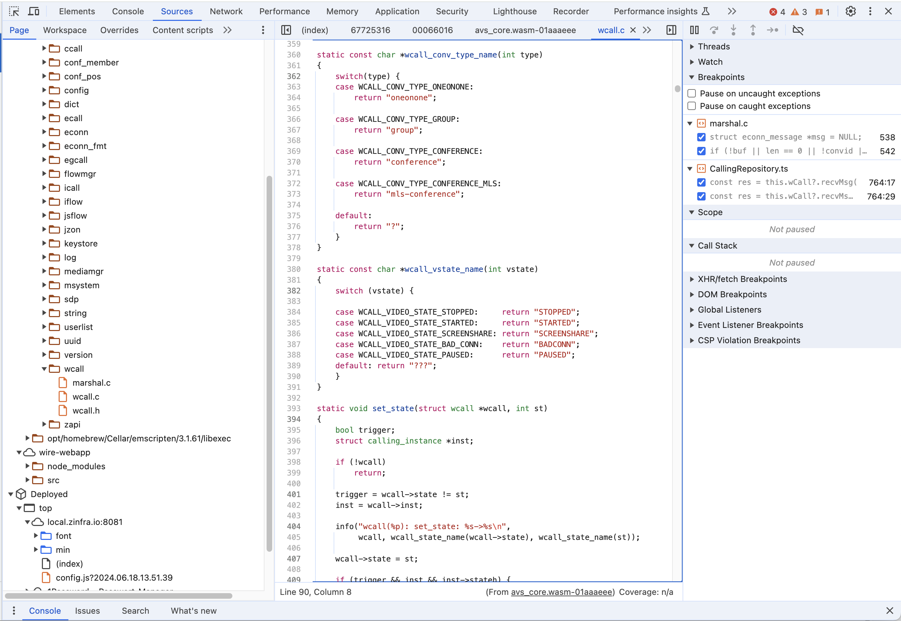

# AVS WASM Debugging

## Develop

When working with the web app it is sometimes helpful to debug the AVS. 
To do this you need to create the WASM file with debug information.

### Build WASM with source map

This creates wasm file with debug information

```bash
$ make dist_wasm WASM_DEBUG=1
```

### Link avs project ro wire_webapp

After you have built the wasm, link your local build of `@wireapp/avs` to your local `wire-webapp` like: 

```bash
$ cd cd build/dist/wasm/
$ yarn link
```
Use `yarn link @wireapp/avs` in the root directory of your local `wire-webapp`.

If that doesn't work, there is still the hard way ;)

Add `@wireapp/avs` directly in the `package.json` of `wire-webapp` like

```json
{
  "dependencies": {
    "@wireapp/avs": "file:../wire-avs/build/dist/wasm/"
  }
}
```

### Debugging WebAssembly in Chrome

To get the debug information you need a Chrome extension:
Install the [C/C++ DevTools Support (DWARF) Chrome extension](https://chromewebstore.google.com/detail/cc++-devtools-support-dwa/pdcpmagijalfljmkmjngeonclgbbannb)



Have fun!

