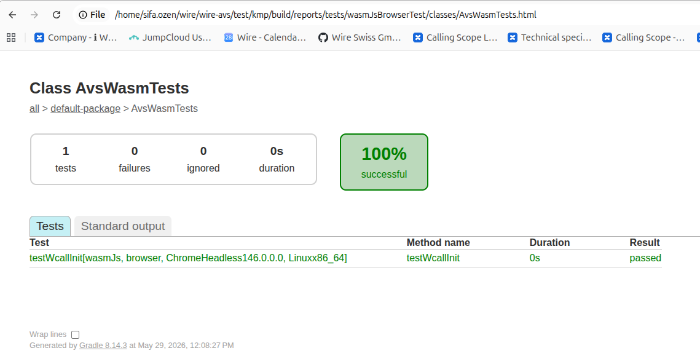

Kmp Package Smoke Tests
-----------------------

Tests to validate generaed kmp package locally before publishing to maven central.
It is very hard to remove published packages from maven central, therefore this test
does a smoke verification of the created kmp package from local maven before 
publishing to mave central

In order to test locally

* clean **./build** caches  
```bash
wire-avs$ make clean distclean dist_clean
```

* get necessary tools and set corresponding environment variables  
```bash
wire-avs$ source ./scripts/wasm_devenv.sh
wire-avs$ source ./scripts/android_devenv.sh
```

* build dist binares (in ios build ios and macos disributions as well; **dist_xc**)
```bash
wire-avs$ make dist_android dist_wasm 
```

* publish to local maven, with (default) version that will be used in kmp tests
```bash
wire-avs$ ORG_GRADLE_PROJECT_VERSION_NAME=0.0.1 ./gradlew :avs:clean publishToMavenLocal  
```

* trigger kmp tests, that will run on the local published artifact  
```bash
wire-avs$ ./gradlew :test:kmp:clean :test:kmp:wasmJsBrowserTest
```

* test results can be seen from generated html (file://**project-root-path**/wire-avs/test/kmp/build/reports/tests/wasmJsBrowserTest/index.html) 

